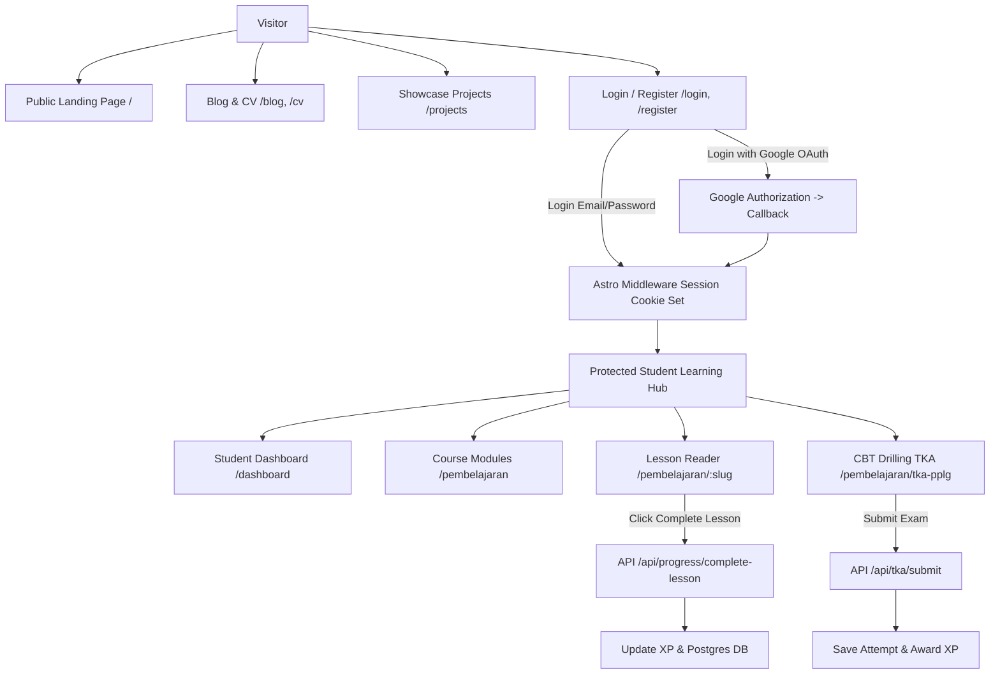

# Design Specification: Fullstack Student Learning Hub & Gamification Portal

**Project:** agunggumelarsaputra.com  
**Owner:** Agung Gumelar Saputra, S.Tr.T.  
**Date:** 2026-08-05  
**Status:** Approved (With Google OAuth Support)  
**Target Infrastructure:** Vercel Hobby Plan (100% Free / Rp 0)  

---

## 1. Executive Summary & Vision

Platform ini ditransformasikan dari website portofolio statis menjadi **Fullstack Student Learning Hub & Gamification Portal** interaktif ala **Dicoding / Codepolitan / W3Schools** untuk jurusan Rekayasa Perangkat Lunak (PPLG) SMKN 1 Rongga & ekosistem Teknologi Pendidikan.

### Key Objectives:
1. **Student Authentication & Access Control:** Siswa dapat mendaftar dan masuk menggunakan **Email/Password** ATAU **Google OAuth 1-Klik**. Akses materi belajar (`/pembelajaran/*`), dashboard siswa, dan simulasi TKA memerlukan login.
2. **Gamified Dashboard:** Melacak XP, Level, Daily Streak, Lencana Prestasi (Badges), dan Leaderboard siswa secara real-time.
3. **Interactive Learning Path & Progress Tracking:** Materi Kurikulum Merdeka PPLG disajikan terstruktur. Siswa dapat menandai bab yang selesai untuk mendapatkan XP dan mencatat progres di database.
4. **Drilling TKA PPLG Simulator:** Simulasi ujian CBT interaktif dengan timer, jawaban otomatis terintegrasi ke akun siswa, dan penyimpan hasil ujian di database.
5. **Zero-Cost Operation ($0 / Rp 0):** Menggunakan Astro v5 + Vercel Postgres Free Tier + Static Pre-rendering agar berjalan tanpa biaya server sepeser pun.

---

## 2. Technology Stack & Architecture

| Component | Technology | Role / Usage |
|-----------|------------|--------------|
| **Core Framework** | Astro v5 (Hybrid Rendering) | SSG untuk halaman publik/materi + SSR untuk API & Dashboard |
| **Adapter** | `@astrojs/vercel` | Integrasi native Vercel Serverless & Edge Network |
| **Styling** | TailwindCSS v3 + Typography | UI/UX Dark theme modern, responsive, & clean |
| **Database** | Vercel Postgres (Neon PostgreSQL) | Penyimpanan data siswa, XP, progres bab, & skor TKA |
| **ORM** | Drizzle ORM (`drizzle-orm`, `drizzle-kit`) | Query SQL berkecepatan tinggi dengan TypeScript type-safety |
| **Authentication** | Native Astro Middleware + HTTP-Only Cookies + Google OAuth | Support login Credentials (`bcryptjs`) & **Google OAuth 2.0** |
| **Content Engine** | Astro Content Collections (`astro:content`) | Pengelolaan modul materi berformat MDX/Markdown |

---

## 3. User Flow & Route Protection



### Route Protections (via `src/middleware.ts`):
- **Public Routes:** `/`, `/blog`, `/blog/*`, `/cv`, `/projects`, `/login`, `/register`, `/api/auth/*`
- **Protected Routes (Redirect to `/login` if unauthenticated):**
  - `/dashboard`
  - `/pembelajaran`
  - `/pembelajaran/*`
  - `/api/progress/*`
  - `/api/tka/*`
  - `/api/user/*`

---

## 4. Database Schema (Drizzle ORM)

File Schema: `src/db/schema.ts`

```typescript
import { pgTable, serial, text, integer, timestamp } from 'drizzle-orm/pg-core';

// Users Table (Supports both Email/Password and Google OAuth)
export const users = pgTable('users', {
  id: serial('id').primaryKey(),
  name: text('name').notNull(),
  email: text('email').notNull().unique(),
  passwordHash: text('password_hash'), // Nullable for Google OAuth users
  googleId: text('google_id').unique(), // For Google OAuth tracking
  role: text('role').default('student').notNull(), // 'student' | 'teacher' | 'admin'
  avatarUrl: text('avatar_url'),
  createdAt: timestamp('created_at').defaultNow().notNull(),
});

// User Gamification Stats Table
export const userGamification = pgTable('user_gamification', {
  id: serial('id').primaryKey(),
  userId: integer('user_id').references(() => users.id, { onDelete: 'cascade' }).notNull().unique(),
  xp: integer('xp').default(0).notNull(),
  level: integer('level').default(1).notNull(),
  streakDays: integer('streak_days').default(1).notNull(),
  lastActiveDate: timestamp('last_active_date').defaultNow().notNull(),
});

// User Course/Lesson Progress Table
export const userProgress = pgTable('user_progress', {
  id: serial('id').primaryKey(),
  userId: integer('user_id').references(() => users.id, { onDelete: 'cascade' }).notNull(),
  lessonSlug: text('lesson_slug').notNull(),
  completedAt: timestamp('completed_at').defaultNow().notNull(),
});

// TKA Exam Attempts Table
export const tkaAttempts = pgTable('tka_attempts', {
  id: serial('id').primaryKey(),
  userId: integer('user_id').references(() => users.id, { onDelete: 'cascade' }).notNull(),
  score: integer('score').notNull(),
  totalQuestions: integer('total_questions').notNull(),
  correctAnswers: integer('correct_answers').notNull(),
  xpEarned: integer('xp_earned').default(0).notNull(),
  createdAt: timestamp('created_at').defaultNow().notNull(),
});
```

---

## 5. Gamification Mechanics & Formulas

1. **Level Formula:**
   $$\text{Level} = \lfloor \sqrt{\frac{\text{XP}}{50}} \rfloor + 1$$
   - 0 XP = Level 1
   - 50 XP = Level 2
   - 200 XP = Level 3
   - 450 XP = Level 4
   - 800 XP = Level 5

2. **XP Reward Rules:**
   - **Menyelesaikan Modul/Bab Materi:** +15 XP per bab.
   - **Menyelesaikan Simulasi TKA PPLG:** +10 XP dasar + (Skor % × 0.5) bonus XP.
   - **Daily Login Streak:** +5 XP per hari berturut-turut.

3. **Badges & Achievement Unlocks:**
   - 🥉 *Novice Coder:* Level 2 tercapai.
   - 🥈 *Database Specialist:* Menyelesaikan semua modul SQL.
   - 🥇 *TKA Master:* Mendapat skor ≥ 85 pada Simulasi Drilling TKA.
   - ⚡ *Consistent Learner:* Daily Streak ≥ 7 hari.

---

## 6. API Endpoints Specification

### Authentication API Routes (`src/pages/api/auth/`)
- `POST /api/auth/register`: Validasi nama, email unik, hash password (`bcryptjs`), simpan ke `users` & inisialisasi `userGamification`.
- `POST /api/auth/login`: Validasi kredensial, buat session cookie `HttpOnly` (`ags_session`).
- `GET /api/auth/google`: Mengarahkan user ke Google OAuth Authorization Consent Screen.
- `GET /api/auth/callback/google`: Menerima authorization code dari Google, mengambil email & nama user, membuat/mencari akun di `users`, lalu menetapkan session cookie `ags_session`.
- `POST /api/auth/logout`: Hapus session cookie `ags_session` dan redirect.
- `GET /api/auth/me`: Mengembalikan data profil user yang sedang login beserta XP & Level.

### Gamification & Learning Progress API Routes (`src/pages/api/progress/`)
- `POST /api/progress/complete-lesson`: Menerima `{ lessonSlug }`. Memeriksa jika belum selesai, masukkan ke `userProgress`, tambahkan +15 XP ke `userGamification`, hitung pembaruan Level.
- `POST /api/tka/submit`: Menerima `{ score, totalQuestions, correctAnswers }`. Simpan attempt ke `tkaAttempts`, tambahkan XP bonus ke user.
- `GET /api/leaderboard`: Mengembalikan 10 siswa dengan XP tertinggi untuk widget peringkat.

---

## 7. Verification & Acceptance Criteria

1. **Keamanan & Middleware:**
   - Membuka `/dashboard` atau `/pembelajaran` saat belum login wajib me-redirect user ke `/login`.
   - Cookie session menggunakan `HttpOnly`, `SameSite=Lax`, `Path=/`, dan `Secure` di environment produksi.
2. **Autentikasi User (Credentials & Google OAuth):**
   - User baru bisa Register dengan Email/Password.
   - User bisa Login 1-Klik menggunakan Google OAuth.
3. **Learning Hub & XP Integration:**
   - Halaman modul `/pembelajaran/[slug]` menampilkan tombol "Tandai Selesai (+15 XP)".
   - Ketika diklik, XP di database bertambah secara otomatis dan UI Dashboard memperbarui statistik secara real-time.
4. **Drilling TKA PPLG:**
   - Siswa mengerjakan quiz TKA. Setelah selesai, skor dan XP tersimpan di Vercel Postgres.
5. **Zero-Cost Build Verification:**
   - Memastikan `npm run build` sukses membuat output bundle Astro SSR untuk Vercel.

---

## 8. Development Timeline & Phases

- **Phase 1:** Dependency Setup (Drizzle ORM, `@astrojs/vercel`, `pg`, `bcryptjs`, `jsonwebtoken`/session, `arctic` / Google OAuth SDK).
- **Phase 2:** Database Connection & Schema Migration File.
- **Phase 3:** Authentication System (Middleware, `/login`, `/register`, Google OAuth Endpoints `/api/auth/google`, `/api/auth/callback/google`).
- **Phase 4:** Student Dashboard (`/dashboard`) & Gamification Engine (`/api/progress/*`).
- **Phase 5:** Learning Hub UI Modernization (W3Schools/Dicoding style lesson layout & progress tracker).
- **Phase 6:** TKA Drilling Integration with Database Score History.
- **Phase 7:** Deployment Check to Vercel Free Tier & Final Verification.
